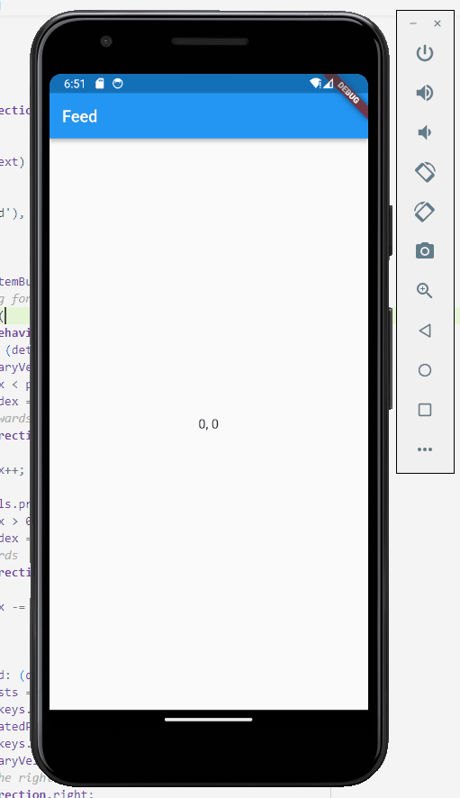

# multi-direction swipe widget

### This widget handles swiping in four directions. For the sake of the demo, there is some added complexity to play around. This has an ordered dictionary (or hashlinkedmap). There is looping on rows but not columns. You can swipe up on any page except the first (index: 0) for that row.
  

